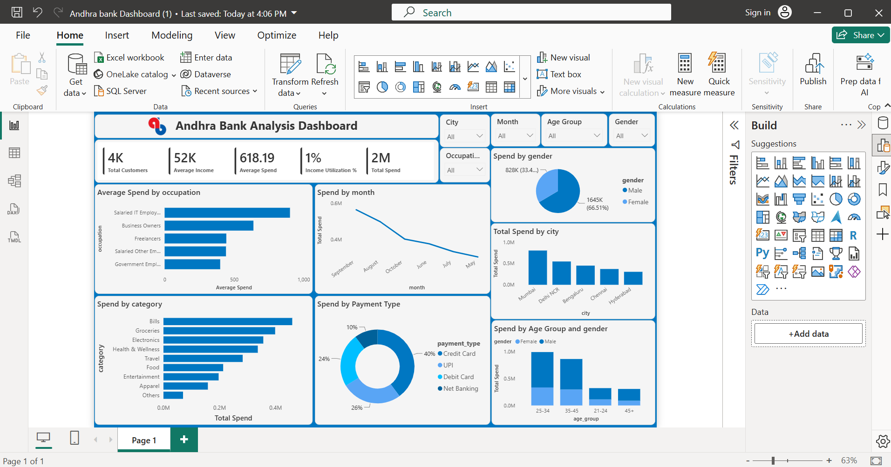

# 🏦 Andhra Bank Analysis Dashboard


---

## 📌 Project Overview

Developed an interactive Andhra Bank Analysis Dashboard in Microsoft Power BI to analyze customer accounts, banking transactions, deposits, loans, and overall branch performance. The dashboard provides actionable insights through interactive visualizations, helping stakeholders monitor financial performance and support data-driven decision-making.

---

## 🎯 Project Objectives

- Analyze customer account information
- Monitor deposits and loan performance
- Evaluate branch-wise performance
- Track banking transactions and KPIs
- Build an interactive dashboard for business reporting

---

## 🛠 Technologies Used

- Microsoft Power BI
- Power Query
- DAX
- Data Modeling
- Data Visualization

---

## 📊 Dashboard Features

- Customer Analysis
- Deposit Analysis
- Loan Analysis
- Branch Performance
- Transaction Summary
- KPI Cards
- Interactive Filters & Slicers

---

## 📷 Dashboard Preview



---

## 📈 Key Performance Indicators (KPIs)

- Total Customers
- Total Deposits
- Total Loans
- Branch Performance
- Account Distribution
- Transaction Volume

---

## 💡 Business Insights

- Compared deposit and loan performance across branches.
- Identified customer and account distribution trends.
- Monitored financial KPIs using interactive visualizations.
- Enabled management to evaluate branch performance effectively.

---

## 📂 Folder Structure

```text
09-PowerBI-AndhraBank-Analysis
│
├── README.md
├── LICENSE
│
├── Dashboard
│   └── Andhra_Bank_Analysis.pbix
│
├── Dataset
│   └── Andhra_Bank_Data.xlsx
│
└── Images
    └── Dashboard.png
```

---

## 🚀 Future Improvements

- Add year-over-year financial comparison.
- Integrate live banking data.
- Include customer segmentation analysis.

---

## 👨‍💻 Author

**Shivam Choudhry**
